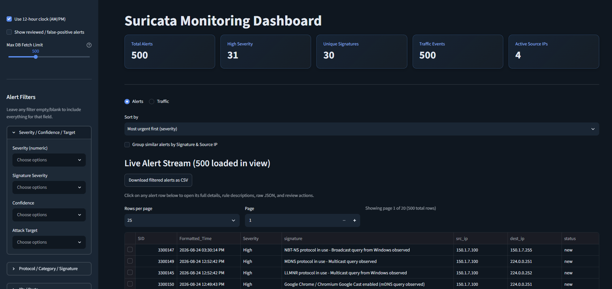

# Suricata Monitoring Dashboard

A lightweight, self-hosted Streamlit dashboard for live-monitoring Suricata IDS alerts and traffic events. It tails Suricata's `eve.json` log, ingests events into a local SQLite database, and presents them in a searchable, filterable, auto-refreshing web UI. No external services, cloud dependencies, or paid tools required.

**Repo:** https://github.com/Sameeha135/suricata-dashboard




---

## Table of Contents

- [Overview](#overview)
- [Architecture](#architecture)
- [Prerequisites](#prerequisites)
- [Installation](#installation)
- [Running the Dashboard](#running-the-dashboard)
- [Features](#features)
- [Configuration](#configuration)
- [Data Model](#data-model)
- [Log & Database Rotation](#log--database-rotation)
- [Troubleshooting](#troubleshooting)
- [Known Limitations](#known-limitations)
- [Repository Structure](#repository-structure)

---

## Overview

This dashboard is designed for a lab or small-network Suricata deployment where you want a fast, visual way to review alerts without standing up a full SIEM stack. It:

- Reads Suricata's native `eve.json` output directly: no separate log shipper needed
- Stores parsed events in SQLite (WAL mode) for fast querying and offline review
- Enriches alerts with rule-catalog metadata (`msg`, `classtype`, ports, direction, etc.) from ET Open / community rule JSON exports
- Auto-refreshes in the browser without manual reloads
- Supports marking alerts as reviewed / false-positive, filtering on nearly every field, and exporting to CSV

It is built for **local or trusted-network use**: see [Known Limitations](#known-limitations) before exposing it beyond your lab.

---

## Architecture

```
Suricata (live capture)
        │
        ▼
  /var/log/suricata/eve.json   (Suricata's own log rotation: rotate-interval + logrotate)
        │
        ▼
  modules/ingestor.py           (background thread, tails file from last offset,
        │                        parses JSON lines, batches inserts)
        ▼
  alerts.db  (SQLite, WAL mode) (auto-rotates to alerts_archive_<timestamp>.db
        │                        once alerts table passes 25,000 rows)
        ▼
  app.py (Streamlit UI)         (auto-refreshing fragments, filters, charts,
                                  review workflow)
```

There are two independent rotation mechanisms in this system:

1. **`eve.json` rotation**: happens at the Suricata/OS level (`suricata.yaml`'s `rotate-interval` plus a `logrotate` policy). Controls the size of Suricata's raw log file on disk. This is not part of this repo's code; it's a one-time system configuration step covered in [Log & Database Rotation](#log--database-rotation).
2. **SQLite `alerts.db` rotation**: handled entirely by `check_and_rotate_db()` in `modules/ingestor.py`. Once the live `alerts` table hits 25,000 rows, the whole file is renamed to `alerts_archive_<YYYYMMDD_HHMMSS>.db` and a fresh empty `alerts.db` is created, so the dashboard's active queries stay fast. Older data isn't deleted, it just moves to an archive file the dashboard doesn't query by default.

### Concurrency model

Only one ingestion pass runs at a time, enforced by a process-wide `threading.Lock()` (`INGEST_LOCK` in `app.py`) plus a global last-run timestamp: this prevents multiple browser tabs from triggering simultaneous writers and hitting SQLite lock contention. All SQLite connections use `timeout=30.0` + `PRAGMA busy_timeout=30000`, so a connection will wait rather than fail instantly if the DB is briefly locked by another writer.

---

## Prerequisites

- **Suricata**, installed and actively capturing in live mode (`af-packet`), logging to `eve.json` with at minimum `alert` and `stats` event types enabled in `suricata.yaml`.
- **Python 3.9+** (the code uses `zoneinfo`, standard library since 3.9: no `pytz` needed).
- Read access to Suricata's log directory (default `/var/log/suricata/eve.json`) from the account running the dashboard. On most distros this means either running the dashboard as the `suricata` user/group, or adding your user to that group.
- (Optional) An ET Open or community Suricata rules JSON export, for alert enrichment: see [Configuration](#configuration).

---

## Installation

```bash
# 1. Clone the repo
git clone https://github.com/Sameeha135/suricata-dashboard.git
cd suricata-dashboard

# 2. Create and activate a virtual environment
python3 -m venv venv
source venv/bin/activate

# 3. Install dependencies
pip install -r requirements.txt
```

`requirements.txt`:
```
streamlit>=1.35
pandas
plotly
```
*(`streamlit>=1.35` is required specifically for the `@st.fragment(run_every=...)` auto-refresh feature used throughout `app.py`: older versions will run but the live-update behavior won't work, and you'll only see new data on manual page reload.)*

---

## Running the Dashboard

```bash
cd suricata-dashboard
source venv/bin/activate
streamlit run app.py
```

By default Streamlit serves on port `8501`. It will print both a local and network URL, e.g.:
```
Local URL:   http://localhost:8501
Network URL: http://192.168.x.x:8501
```
Use the Network URL to access it from another machine on the same subnet (e.g. viewing the dashboard from your host machine while Suricata runs inside a VM).

**First-run note:** on first launch, `ingestor.py`'s `init_db()` creates `alerts.db`, `alerts_archive*.db` (only if/when rotation triggers), and `eve_offset.txt` (tracks how far into `eve.json` has already been read, so restarting the dashboard doesn't re-ingest or lose events).

---

## Features

### Alerts tab
- **Live Alert Stream**: auto-refreshes every 2 seconds (`render_live_alerts_section`, `@st.fragment(run_every="2s")`), newest alerts appear without touching the page.
- **Sorting**: by severity (most urgent first), newest/oldest, or confidence.
- **Grouping**: toggle "Group similar alerts by Signature & Source IP" to collapse repeated alerts into aggregated counts with first-seen/last-seen timestamps, instead of one row per event.
- **Filtering (sidebar)**: severity, signature severity, confidence, attack target, protocol, category, signature ID (partial match), signature text (plain or regex), source/dest IP (plain or regex), source/dest port (single value or range, e.g. `1000-2000`), interface, direction, flow ID, byte-count ranges, and a time-range slider.
- **Detail view**: click any row to see full alert metadata, rule catalog enrichment (message, classtype, action, ports, direction, ruleset, vendor), and the complete raw JSON event.
- **Review workflow**: mark an alert "Reviewed" or "False Positive," or reopen it back to "new."
- **CSV export**: download the currently filtered alert set.
- **Max DB Fetch Limit** slider: caps how many rows are pulled per query (250-2000); lower values keep the UI faster on large datasets.

### Analytics & Trends
Refreshes every 15 seconds (`render_alerts_analytics`, decoupled from the faster table refresh so chart re-renders don't slow down row browsing):
- Alerts-over-time line chart
- Top 10 signatures bar chart
- Severity breakdown bar chart

### Traffic tab
- Full traffic event stream with the same filter set as alerts (event type, protocol, app protocol, IPs/ports, interface, direction, flow ID, byte ranges)
- CSV export
- Traffic-over-time chart, top talkers (by source IP), protocol distribution chart

### KPI row (top of page)
Total alerts, high-severity count, unique signature count, total traffic events, and active source IP count: always reflects the current `Max DB Fetch Limit` and "show reviewed" settings.

---

## Configuration

| Setting | Where | Default | Notes |
|---|---|---|---|
| Suricata log path | `modules/ingestor.py` → `EVE_LOG_PATH` | `/var/log/suricata/eve.json` | Change if your Suricata install logs elsewhere. |
| SQLite DB path | `modules/ingestor.py` → `DB_PATH` | `alerts.db` (relative to app working dir) | |
| Ingest polling interval | `app.py` → `INGEST_INTERVAL_SECONDS` | `2` seconds | How often the background thread checks for new log lines. |
| Alert table live-refresh interval | `app.py` → `@st.fragment(run_every="2s")` on `render_live_alerts_section` | `2s` | |
| Analytics refresh interval | `app.py` → `@st.fragment(run_every="15s")` on `render_alerts_analytics` | `15s` | |
| Traffic row cap | `modules/ingestor.py` → `MAX_TRAFFIC_ROWS` | `5000` | Oldest traffic rows are pruned past this. |
| Alert table rotation threshold | `modules/ingestor.py` → `MAX_ALERT_ROWS_BEFORE_ROTATE` | `25000` | Triggers archive-and-reset (see below). |
| Local timezone | `app.py` → `LOCAL_TZ` | `Asia/Karachi` | Change to your own IANA timezone string. |
| Rule catalog files | `modules/data_loader.py` → `load_rule_catalog()` args | `suricata_et_rules.json`, `suricata_community_sample.json` | Place these JSON files in the project root. If missing, the app logs `[INFO] Rule file '...' not found` and simply skips enrichment: it won't crash. |

---

## Data Model

**`alerts` table**
| Column | Type | Notes |
|---|---|---|
| `id` | INTEGER PK | autoincrement |
| `dedup_key` | TEXT UNIQUE | `{flow_id}_{signature_id}_{timestamp}`: prevents duplicate ingestion of the same event |
| `timestamp` | TEXT | ISO8601, from Suricata |
| `src_ip`, `src_port`, `dest_ip`, `dest_port`, `proto` | | |
| `in_iface`, `flow_id`, `direction` | | |
| `bytes_toserver`, `bytes_toclient` | INTEGER | |
| `signature`, `signature_id`, `category`, `severity` | | |
| `signature_severity`, `confidence`, `attack_target` | TEXT | from Suricata's `alert.metadata` |
| `raw_json` | TEXT | full original event, stored verbatim |
| `enrichment_json` | TEXT | rule-catalog match at ingest time (snapshotted, not looked up live) |
| `status` | TEXT | `new` / `reviewed` / `false_positive`, default `new` |

**`traffic` table**
`timestamp`, `event_type`, `src_ip`, `src_port`, `dest_ip`, `dest_port`, `proto`, `app_proto`, `in_iface`, `flow_id`, `direction`, `bytes_toserver`, `bytes_toclient`, `uptime_sec`, `packets_captured`, `packets_dropped`, `decoder_pkts`, `decoder_bytes`

**`state` table**
Single-purpose key/value store: currently just `file_offset`, tracking how far into `eve.json` has been read, so ingestion resumes correctly across restarts instead of re-reading the whole file.

---

## Log & Database Rotation

### 1. `eve.json` rotation (system-level, one-time setup)

In `/etc/suricata/suricata.yaml`, under the `eve-log` output block:
```yaml
outputs:
  - eve-log:
      enabled: yes
      filetype: regular
      filename: eve.json
      rotate-interval: day
```

Pair with a `logrotate` policy so old rotated files eventually get pruned:
```bash
sudo tee /etc/logrotate.d/suricata-eve <<'EOF'
/var/log/suricata/eve.json-*
{
    su suricata suricata
    rotate 3
    missingok
    notifempty
    compress
    delaycompress
    maxsize 200M
}
EOF
```
Restart Suricata after editing `suricata.yaml`:
```bash
sudo systemctl restart suricata
```
The `su suricata suricata` line is required if `/var/log/suricata/` is owned by the `suricata` user rather than `root`: without it, `logrotate` will silently skip rotation with an "insecure permissions" warning.

### 2. `alerts.db` rotation (handled automatically by this app)

No setup needed: `check_and_rotate_db()` in `modules/ingestor.py` runs on every ingest cycle. Once `alerts` passes 25,000 rows, it:
1. Runs `PRAGMA wal_checkpoint(TRUNCATE)` to flush pending WAL writes
2. Renames `alerts.db` → `alerts_archive_<YYYYMMDD_HHMMSS>.db`
3. Creates a fresh `alerts.db`, preserving the `file_offset` state so no log lines are skipped or duplicated

Archived files are **not** deleted and **not** queried by the dashboard by default: they're just historical snapshots. Query one directly if needed:
```bash
sqlite3 alerts_archive_20260817_122250.db "SELECT COUNT(*) FROM alerts;"
```

---

## Troubleshooting

**Dashboard shows no new alerts even though Suricata is generating them**
- Confirm Suricata is in live capture mode, not reading a pcap file offline (`sudo journalctl -u suricata` should show `af-packet` binding to your interface, not `pcap file`).
- Confirm `EVE_LOG_PATH` in `ingestor.py` points to the real live log, not a leftover offline-test path.
- If the browser tab was open before ingestion started, it may just need one interaction (or wait for the next `run_every` tick): the live fragments refresh automatically, but very old tab sessions can occasionally need a manual reload.

**`database is locked` errors in the terminal**
- Should not happen under normal use: all connections use `timeout=30.0` + `PRAGMA busy_timeout=30000`, and ingestion is serialized via `INGEST_LOCK`. If you still see this, check whether an external process (e.g. `sqlite3 alerts.db` opened manually in another terminal, or a stray Suricata offline `-r` precheck run) is holding a long transaction open against the same file.

**Suricata log shows `unix-manager: failed to create socket directory /var/run/suricata/: Permission denied`**
- Harmless for this dashboard: it only affects Suricata's runtime control socket (`suricatasc`), not `eve.json` logging or packet capture. Safe to ignore, or fix with:
  ```bash
  sudo mkdir -p /var/run/suricata && sudo chown suricata:suricata /var/run/suricata
  ```

**No rule catalog / enrichment info showing in alert details**
- Check the terminal for `[INFO] Rule file 'suricata_et_rules.json' not found`: this means the JSON file isn't in the project root (or wherever `data_loader.py` expects it). The dashboard still works without it; alerts just won't show rule message/classtype/etc.

**`eve.json` or `alerts.db` growing very large / disk filling up**
- See [Log & Database Rotation](#log--database-rotation) above: confirm both mechanisms are actually configured, not just one.
- If a VM hosting Suricata becomes unresponsive during a heavy traffic replay/burst, check the **host** machine's free disk space too: a dynamically-expanding VM disk can exhaust host storage even if the guest OS itself looks fine.

**Charts fail to render / `ModuleNotFoundError: No module named 'plotly'`**
- `plotly` must be installed: see [Installation](#installation).

**Live auto-refresh doesn't work, only manual page reload shows new data**
- Confirm `streamlit>=1.35` is actually installed: `pip show streamlit`. Older versions silently ignore the `run_every` parameter on `@st.fragment`.

---

## Known Limitations

- **No authentication**: this dashboard has no login/access control. It's intended for local or trusted-LAN use only. Do not expose it directly to the public internet without putting a reverse proxy with auth in front of it.
- **Single-writer SQLite**: while lock/retry handling is in place, extremely high alert volumes (tens of thousands of alerts in a short burst, e.g. from a full-speed pcap replay) can still cause brief ingestion delays. Pacing large replays (e.g. `tcpreplay --pps=200` instead of full speed) avoids this.
- **Rule enrichment is a point-in-time snapshot**: each alert stores the rule catalog match *at ingestion time* (`enrichment_json`). If you update the rule catalog JSON later, previously-ingested alerts won't retroactively pick up the new metadata.

---

## Repository Structure

```
.
├── app.py                     # Streamlit entry point: UI, filters, auto-refresh fragments
├── alerts.db                  # Live SQLite database (git-ignored, auto-created)
├── alerts_archive_*.db        # Rotated-out historical alert snapshots (git-ignored)
├── eve_offset.txt             # Tracks eve.json read position (git-ignored, auto-created)
├── requirements.txt
├── .streamlit/
│   └── config.toml            # Streamlit app configuration
├── modules/
│   ├── __init__.py
│   ├── ingestor.py            # Tails eve.json, parses + inserts events, DB rotation logic
│   ├── alert_store.py         # Alert status updates (reviewed / false_positive / reopen)
│   ├── data_loader.py         # Loads & trims rule catalog JSON for enrichment
│   ├── filters.py             # Sidebar filter widgets for Alerts and Traffic tabs
│   └── charts.py              # All Plotly chart + KPI row functions
├── suricata_community_sample.json   # Rule catalog source (or your own ET Open export)
└── .gitignore
```

Note: `suricata_et_rules.json` (the full ET Open catalog) is referenced by `data_loader.py` but intentionally not committed to the repo (see `.gitignore`: all `*.json` and `*.db` files are excluded) due to its size. Generate or download your own and place it in the project root to enable full rule enrichment.